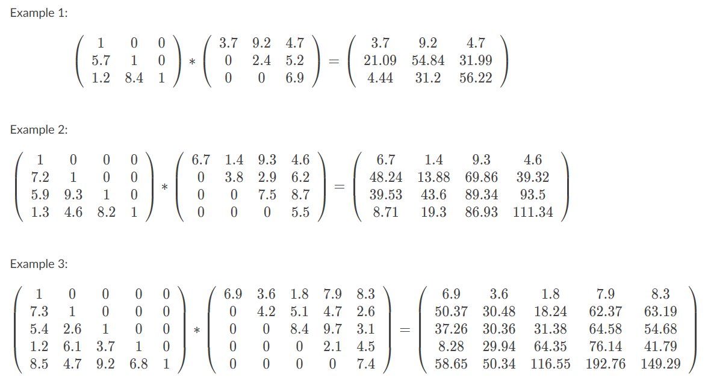

# AUD-Equations Group Work

*Group - Aigner, Wimmer, Sturm, Mayr and Aspöck*

This repository is part of a school group work on matrix calculation. Given a result matrix C the goal of the assignment is to calculate the two matrices A and B which when multiplied result in the matrix C. This problem is simplified by some constant numbers in the calculated matrices. The solution is provided in C# and [Go](https://go.dev/) as described below.

## Repository Structure

* `src` - Directory containing the source code of the project
  * `C#` - Directory containing C# source code
    * `ConsoleApplication` - Source code for the console application
    * `WPFApplication` - Source code for the WPF application (not functional)
  * `Go` - Directory containing Go source code
* `examples` - Directory containing example matrices in .csv format
* [`Angabe`](3q4t10n5.pdf) - Specification and instructions for this school assignment
* [`Todo`](TODO.md) - List for current tasks of the team

## Usage

This project consists of the following parts:
* **C# Console application** 

  In the console you will need to input a path containing a csv file with the result matrix C you want to use for calculation. The program then outputs the matrices A and B.

* **Go application / executables**

  Run the program provided in the latest release as follows: `./equations[.exe] [pathToCsvFile]`

* ~~**C# WPF application**~~ - **not functional**

  The frontend is not in a functional state and should not be used by now - please refer to the console / go application for a functional experience. 

## CSV Format

The input csv file needs to follow these rules:

* The matrix can be of any size, but it must be square (eg. 3x3, 4x4, ...)
* Numbers have to be separated by a semicolon ( ; )
* At the end of the each line there also needs to be a semicolon ( ; )

## Examples

A few example csv files can be found in the `examples` directory. 

